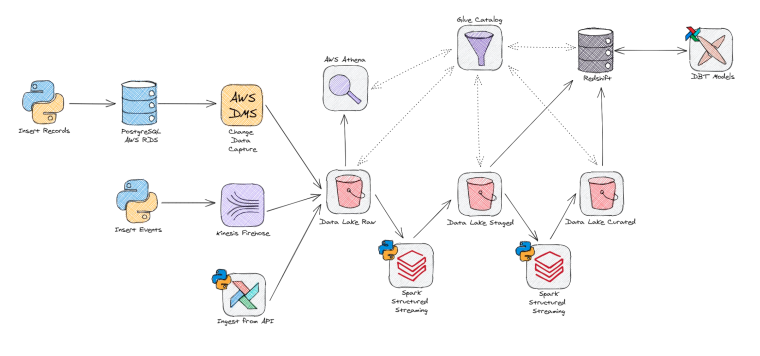

<h1 align="center"> 
	📌 Pipeline lambda com AWS CDK
</h1>

> ### Todo este projeto foi instanciado no bootcamp de engenharia de dados da HOWBootcamps, ministrado pelo senior data engineer André Sionek.

## Falando um poco sobre a HOWBootcamps

A HOW é uma empresa coltada para bootcamps ao vivo, práticos e de curta duração com facilitadores das principais startups do Brasil. Para conhecer o trabalho deles basta acessar o [Site](https://learn.howedu.com.br/todos).

## Bootcamp

No bootcamp de engenaria avançado de dados foi proposto a construção de uma pipeline que nos proporcionaria o contato com a ingestão, tratamento e disponibilidade de dados. Como diferencial o bootcamp focou em entregar a pipeline com automações e testes automatizados para monitoramento de cada etapa.

Como desafio durante todo desafio foi criar uma arquitetura lambda comtemplando as melhores práticas para coloca-lá em produção. Falamos acima sobre a **Arquitetura lambda** e para facilitar o seu entendimento vamos detalhar suas características.

    1. Contempla em sua pipeline fluxos em batch e Real-time ou near-real-time.

    2. Entregua esses resultados em uma mesma camada.

    3. São processados em jobs diferentes

## A arquitetura

Agora que ja sabemos as características da pipeline esboçamos a arquitetura que foi montada e realizada durante o bootcamp.

<center></center>

### Para construi-la vamos seguir o seguinte step-by-step:

    1.  CI/CD instanciado e monitorado por meio do GitHub Actions utilizando e criando worflows.
    2.  Instanciamento de uma banco de dados. 
    3.  Captura de dados com DMS. 
    4.  Coleta de dados por meio de uma stream de dados com o Kinisis. 
    5.  Ingestão de dados por meio de uma API orquestrada pelo Airflow. 
    6.  Criação das três camadas do datalake (bronze, silver, gold).
    7.  Processamento de dados via databricks(microserviço de processamento baseado no framework spark). 
    8.  Catalogo de metadados com glue catalog. 
    9.  Sistema de queries com athena. 
    10. Implementação de um Data WareHouse com a utilização do framework DBT para gestão de um MDW(Modern Data WareHhouse).
    11. Orquestração da pipeline com Airflow.

# Hands-ON


Para montar esta pipeline vamos dividir todo o processo em 3 etapas **(1)** Criação dos ambientes de trabalho, **(2)** Criação da infraestrutura e **(3)** Criação dos seus Jobs e orquestração.


## 1) Criação dos ambientes de trabalho

Caso você esteja trabalhando com mais de uma pessoa em um projeto, ou mesmo sozinho é de extrema importancia **criar hábitos e boas práticas de produção**. Para isso a primeira delas é a utilização de um **ambiente de versionamento de código**, no caso deste repositorio utilizamos o git como versionador local e o github como remoto.

Outra prática é a criação de workflows que vai garantir a qualidade e veracidade de sua aplicação. Esse workflow recebe o nome de CI ou *continouos integration*, e neste estão contidos diversos testes unitários para validação de sua aplicação. Validado a aplicação vamos para o segundo round de teste. Essa parte recebe o nome de CD ou *continouos deployment*, e nesta parte vamos fazer  alguns testes de integração que vão validar como essa nova aplicação está rodando em contato com um sistema ja aplicado.

Dessa maneira temos a nossa "polícia" criada para validar a nossa aplicação. Agora podemos criar os nossos ambientes, estes serão:
* **Production** : Que seria como a nossa aplicação em execução, a utima e a mais estável.
* **Staging** : Que seria a próxima versão a ser executada mas ainda em testes.
* **Deployment** : Ambiente de criação de novas features sem afetar as ja validadas. Neste caso é mais de trabalho pessoal.


## 2) Criação da infraestrutura

Com isso vamos criar pontualmente cada uma das ferramentas da pipeline. Gosto da analogia da construção de uma carro, onde você não constroi o carro como primeira tarefa. Ou seja, precisa que as rodas, o motor a carcaça esta pronta antes de construir ele como um todo.

Dessa maneira, nesta etapa vamos criar os modulos como (1) o banco de dados, (2) o datalake.
## 3) Criação dos seus Jobs

Os jobs esta atralado aos trabalhos e os processamentos atralados a pipeline. Basicamente anexar as leis de negócio para a pipeline.

## 4) A Orquestração

Garantir as automações e o monitoramento de cada parte da pipeline de forma que o uso dela cada vez se torna ainda mais fácil. ALém de todo projeto esta atrelado a um formato de programação chamado desing pattern que facilita a implementação e uso.

# CDK

Como todo o projeto se passa na **AWS** utilizamos a sua toolkit de desenvolvimento própio que permite gerenciar toda uma única pipelina por meio das stacks do cloud formation. É necessario ter a `AWS CLI` instalada assim como o `node` e a biblioteca do `CDK` da sua liguagem de desenvolvimento escolhido para utilizar.

Falando um pouco sobre estrutura do CDK temos as seguintes informações:

O arquivo `cdk.json` diz ao CDK Toolkit como executar seu aplicativo.

Este projeto é montado como um projeto Python padrão.  A inicialização
também cria um virtualenv dentro deste projeto, armazenado sob o processo `.venv'.
diretório.  Para criar o virtualenv, supõe-se que haja um `python3`.
(ou `pyhton` para Windows) executável em seu caminho com acesso ao `venv`.
pacote. Se por qualquer razão a criação automática do virtualenv falhar,
você pode criar o virtualenv manualmente.

Para criar manualmente um virtualenv em MacOS e Linux:

```
$ python3 -m venv .venv
```

Após a conclusão do processo de inicialização e a criação do virtualenv, você pode usar o seguinte
passo para ativar seu virtualenv.

```
source $ .venv/bin/activar
```

Se você é uma plataforma Windows, ativaria o virtualenv desta forma:

```
% .venv\Scripts\activar.bat
```

Uma vez que o virtualenv é ativado, você pode instalar as dependências necessárias.

```
$ pip install -r requirements.txt
```

Neste ponto, você pode agora sintetizar o modelo de CloudFormation para este código.

```
cdk synth $ cdk
```

Para adicionar dependências adicionais, por exemplo, outras bibliotecas CDK, basta adicionar
para seu arquivo `setup.py` e reexecutar o arquivo `pip install -r requirements.txt`.
comando.

## Comandos úteis

 * `cdk ls` lista todas as stacks no aplicativo
 * `cdk synth` emite o modelo de CloudFormation synthesized
 * `cdk deploy` desdobre esta pilha para sua conta/região AWS padrão
 * `cdk diff` compara a pilha implantada com o estado atual
 * `cdk docs` documentação CDK aberta

---

<h1 align="center"> 
	📌 Referências
</h1>